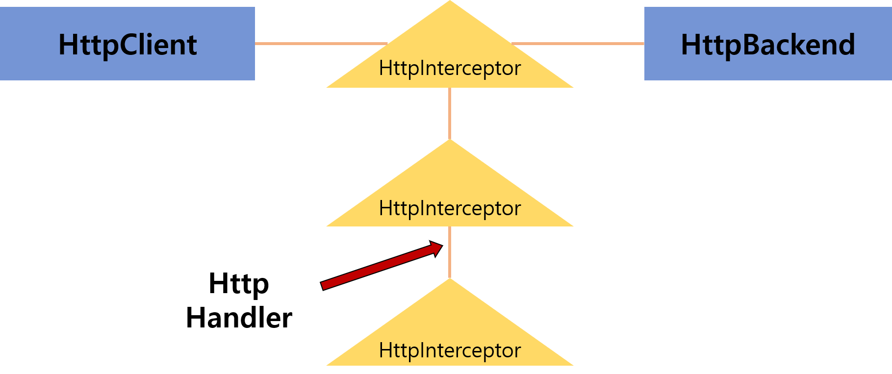

# 인터셉터

- HTTP요청을 검사 또는 변환한다
- 요청 처리 전후에 특정 기능 실행 가능
- 요청/응답 함께 처리 가능하므로 `로그`, `소요시간` 확인 작업 가능
- 사용 시 HttpInterceptor 인터페이스 구현



- HttpHandler는 인터셉터를 체이닝할 때 사용
- 다음 인터셉트 존재하지 않으면 `최종 HttpHandler`인 `HttpBackend`가 되어 옵저버블 반환


```javascript
import { HttpInterceptor,HttpHandler } from "@angular/common/http";

@Injectable()
export class InterceptService implements HttpInterceptor {

    interceptor(req: HttpRequest<any>, next: HttpHandler): Observable<HttpEvent<any>>{
        
        const authToken = tokenExample;
        const clonedRequest = req.clone({
            headers: req.header.set('auth',authToken)
        });

        return next.handle(clonedRequest);
    }
}
```
- interceptor는 `처리 요청` `다음 인터셉터 핸들러` 두가지 인자를 갖는다.
- HttpRequest는 이뮤터블이기 때문에 직접 객체 내용을 변경하지 못한다.
- HttpHandler에게 클론한 요청을 전달한다.